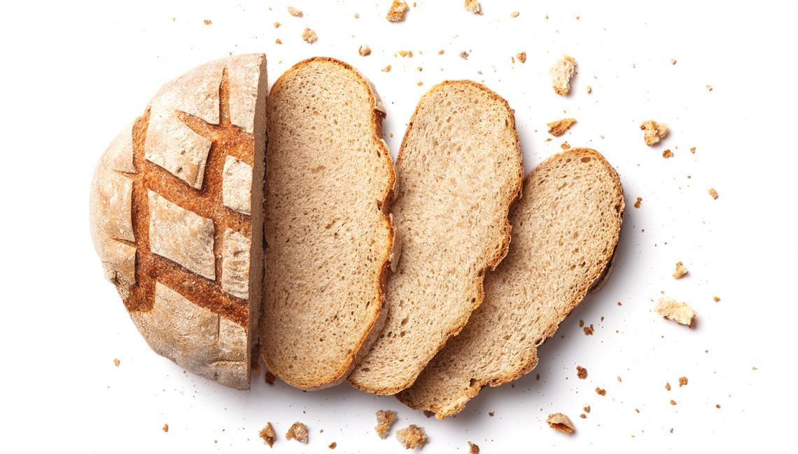
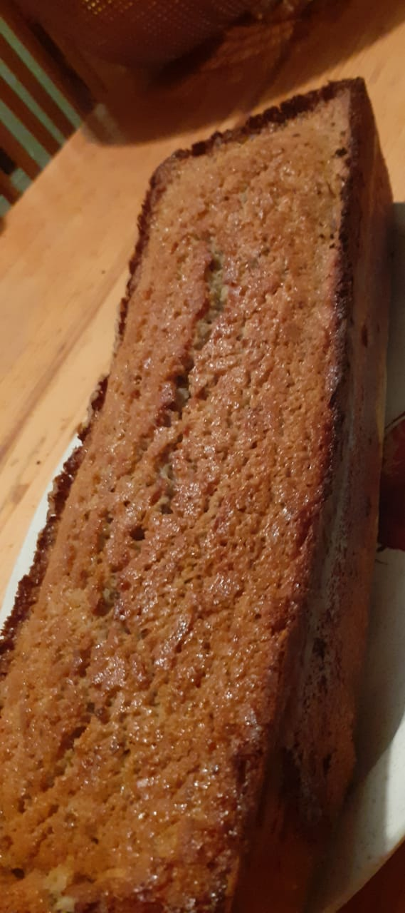
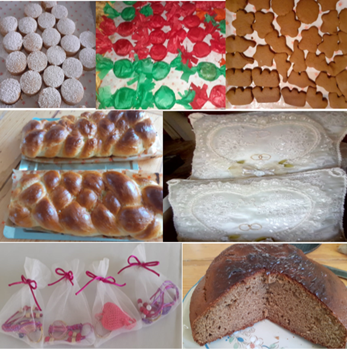
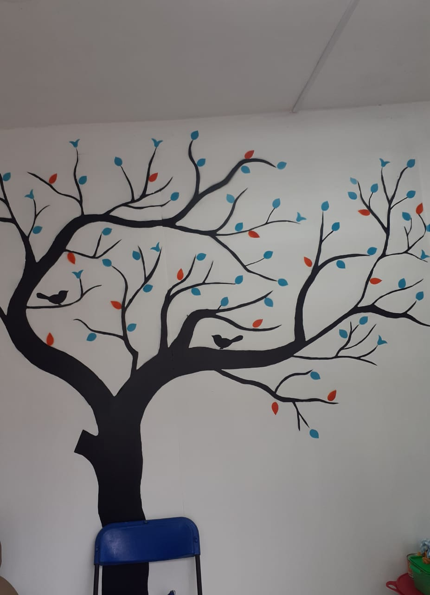
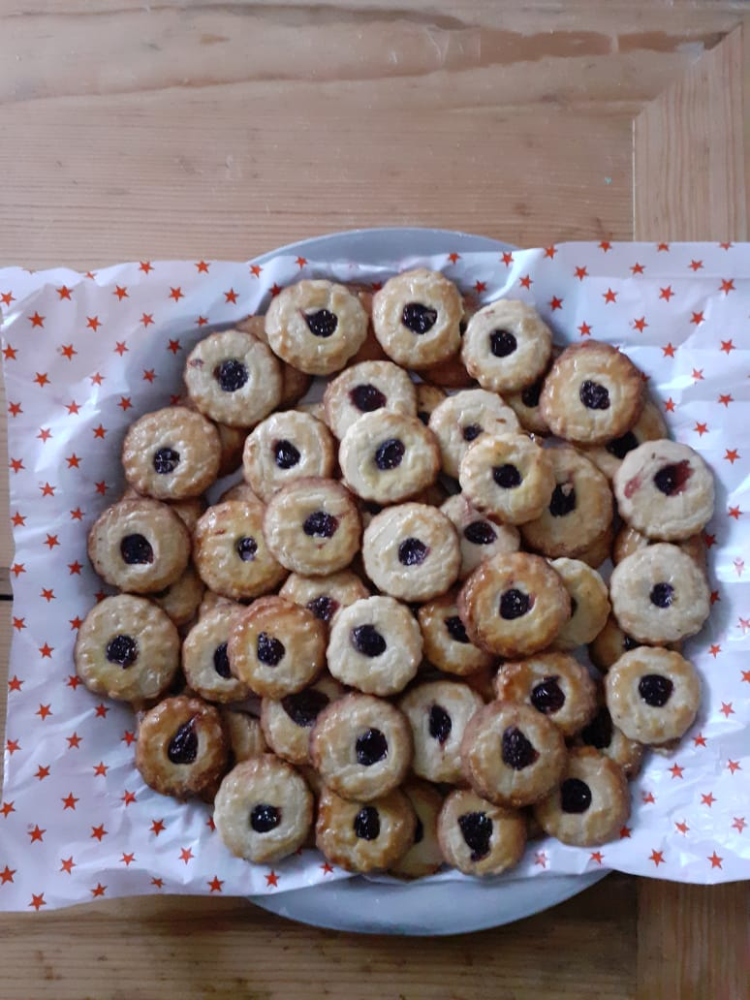
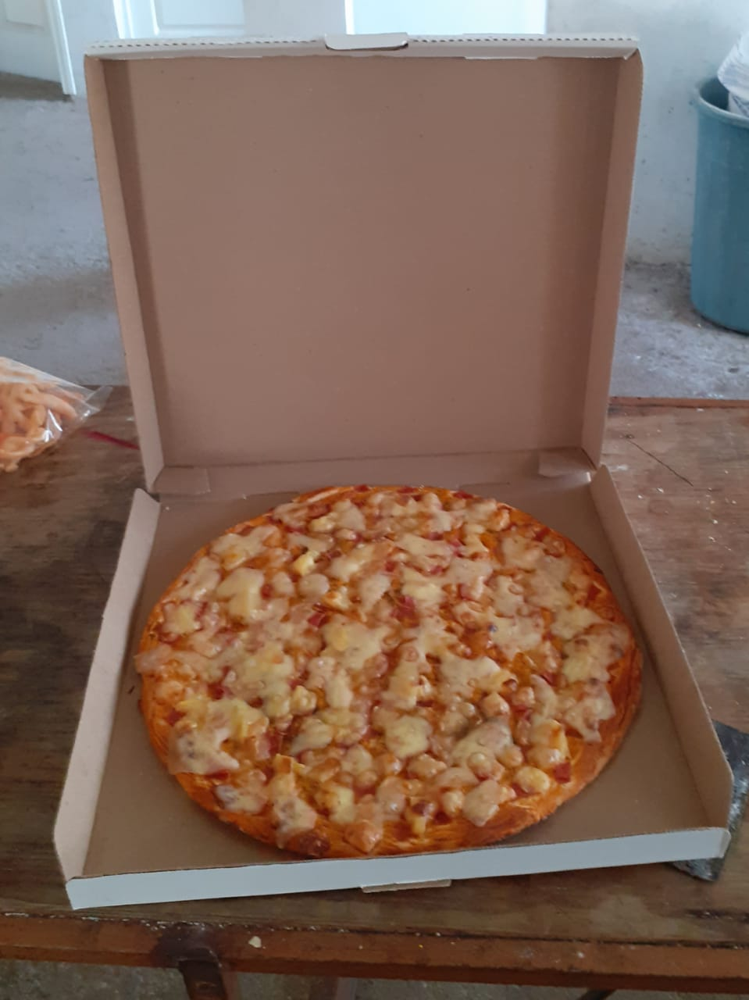

<html lang="en">
  <head>
    <meta charset="UTF-8"/>
    <title>PANADERIA "ADIDIAN"</title>
    
    
    <!-- BOOTSTRAP 4 -->
    <link rel="stylesheet" href="https://stackpath.bootstrapcdn.com/bootstrap/4.1.0/css/bootstrap.min.css" integrity="sha384-9gVQ4dYFwwWSjIDZnLEWnxCjeSWFphJiwGPXr1jddIhOegiu1FwO5qRGvFXOdJZ4" crossorigin="anonymous">
    <!-- SCROOLL REVEAL JS LIBRARY CDN -->
    
    <!-- CUSTOM CSS -->
    <link rel="stylesheet" href="css/main.css">
  </head>
  <body>

    <!-- NAVIGATION -->

    <nav class="navbar navbar-expand-lg navbar-light bg-light fixed-top">
      <a class="navbar-brand" href="#">"ADIDIAN"</a>
      <button class="navbar-toggler" type="button" data-toggle="collapse" data-target="#navbarNavAltMarkup" aria-controls="navbarNavAltMarkup" aria-expanded="false" aria-label="Toggle navigation">
        
      </button>
      

        

          <a class="nav-item nav-link" href="#header">hogar..!</a>
          <a class="nav-item nav-link" href="#info-one">Acerca de</a>
          <a class="nav-item nav-link" href="#contact">contacto</a>
        

      

    </nav>

    <!-- SECTION --> 

    <section id="header">
      

        

            

              <h1  class="display-4">PANADERIA "ADIDIAN"</h1>
              
La mejor panaderia del lugar

              

                        

    <section id="header">
      

        

          

            

              
            
  
          

          

            

              <h1  class="display-4">ERES FAN DEL PAN?</h1>
              
Has llegado al mejor sitio de panaderia! podras encontrar este establecimirnto en: Calle jose maria morelos, #39 "B", seccion 6° San Luis Teolocholco,C.P 90850 Tlaxcala,Tlax

             
            

          

        

      

    </section>

    <section id="testimonial">
      

        

          Pan elaborado con la mejor calidad del lugar, exelente sabor y textura,ideal para esas mañanas en la se antoja un cafe calientito y un delicioso pan..!!!
        

    </section>

    <section id="info-one">
      

        

          

            

            

          

          

            

              <h2>Esta micro empresa no se queda solo con eso tambien le ofrece:.</h2>
              
puede hacer su pedido no solo de pan tambien le ofren pizza,galletas,panque,churros dulces,pay,rosca navideñas,polvorones sevillanos,si usted lo desea tambien mesa de dulces para sus eventos, incluso le ofrece elaboracion de pequeños recuerdos manuales tales como llaveros,catrinas,canastas decoradas,adornos navideños,floreros tejidos,decoraciones con botellas reutilizadas,murales

        

      

    </section>

    <section id="info-two">
      

        

          

            <h2>Para manualidades.</h2>
            
Se hacen por pedido y con tiempo de anticipacion, el tiempo dependera del tipo de trabajo que solicite 

          

          

            <h2>Mas..!</h2>
            
Si se desea alguna manualid o pan especial favor de preguntar si se le puede hacer y dar todas las especificaciones posibles! nosotros buscaremos la forma de complacerlo, unidos es mejor

          

        

      

    </section>

  <ol class="carousel-indicators">
    <li data-target="#carouselExampleCaptions" data-slide-to="0" class="active"></li>
    <li data-target="#carouselExampleCaptions" data-slide-to="1"></li>
    <li data-target="#carouselExampleCaptions" data-slide-to="2"></li>
  </ol>
  

    

      
      

        <h5>MURAL</h5>
        
Se muestra la imagen de un mural con dibujo de un arbol hechopor el personal

      

    

    

      
      

        <h5>GALLETAS- TARTINAS</h5>
        
Galletas hechas con calidad y caseras

      

    

    

      
      

        <h5>PIZZA</h5>
        
Pizza casera 

      

    

  

  <a class="carousel-control-prev" href="#carouselExampleCaptions" role="button" data-slide="prev">
    
    Previous
  </a>
  <a class="carousel-control-next" href="#carouselExampleCaptions" role="button" data-slide="next">
    
    Next
  </a>

          Tambien visita
 
        

       <h6><a href="https://www.dasilva.mx/">Panaderia dasilva</a></h6>

<h6><a href="http://www.la-panadera.com/">Panaderia la panaderia</a></h6>
<h6><a href="http://www.panaderiatroyano.com/">Panaderia Troyano</a></h6>
<h6><a href="https://panaderialamoderna.com/">Panaderia la moderna</a></h6>
<h6><a href="https://panaderialablanca.com/">Panaderia la blanca</a></h6>

    <!-- SCRIPTS -->
    
    
    
    <!-- SCROOLL REVEAL SCRIPT -->
    
  </body>
</html>

